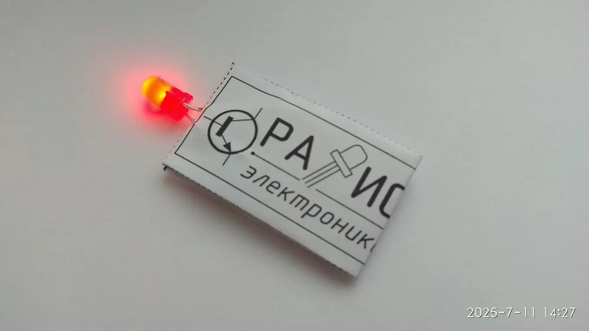
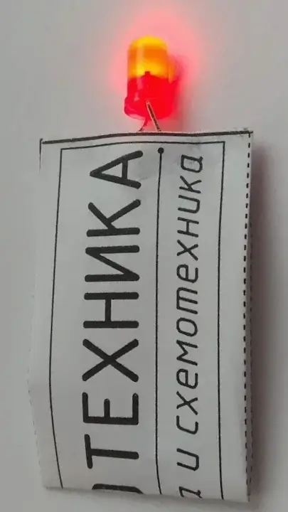

### Описание проекта
Создание конструкции простого фонарика в бумажном корпусе с одним светодиодом и самодельной кнопкой, не требующая пайки. Получение знаний о построении простейшей электрической цепи, принципов ее работы и назначении электронных компонентов.

### Область применения
Освещение замочной скважины на слабоосвещенной лестничной площадке для точного попадания ключом в замок. Создание компактного аварийного источника света на случай внезапного отключения электричества в доме или каюте космического модуля.

### Развитие проекта
Переход от беспаячной схемы к пайке компонентов, замена бумажного корпуса на прочную пластиковую или деревянную конструкцию. Установка более мощного светодиода.

### Файлы проекта
1. 📄[Описание проекта, PDF](fonarik-svetodiodnyj-bumazhnyj.pdf)
2. 📄[Описание проекта, sPlan](fonarik-svetodiodnyj-bumazhnyj.spl8)
