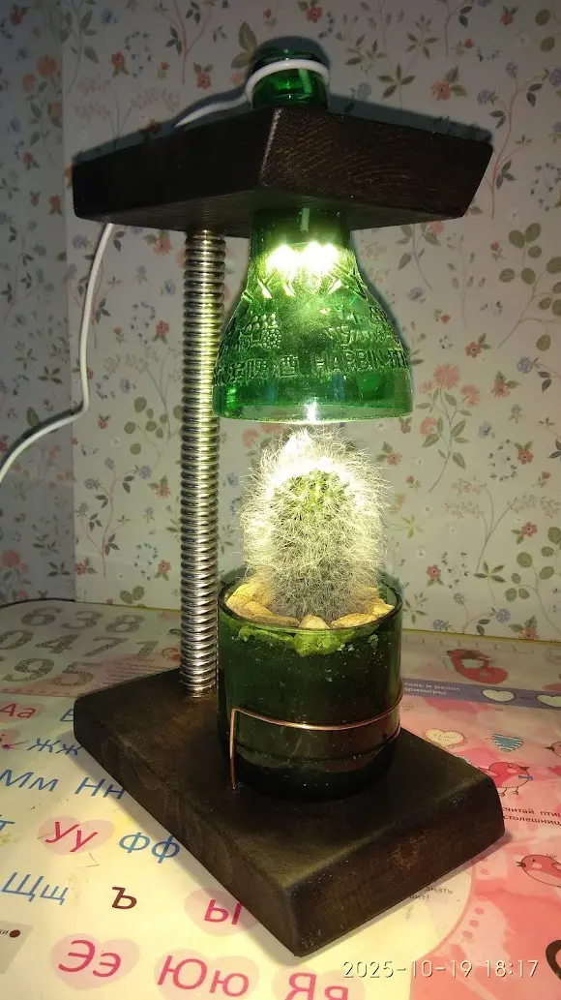
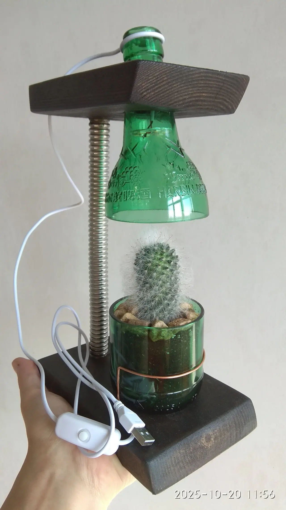
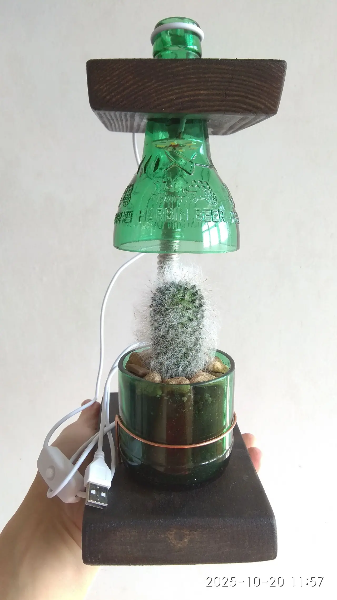

### Описание проекта
Создание конструкции простой настольной светодиодной лампы с плафоном и горшочком из стеклянной бутылки для комнатного растения.

### Область применения
Украшение комнаты или рабочего стола как удобный светильник и уютный уголок для живого комнатного растения.

### Развитие проекта
Проект можно развивать, меняя форму, цвет подставки и абажура или подбирая новые растения для горшочка.

### Файлы проекта
1. 📄[Сборочный чертеж, PDF](nastolnaya-svetodiodnaya-lampa-s-rasteniem.pdf)
2. 📐[Сборочный чертеж, LibreCAD](nastolnaya-svetodiodnaya-lampa-s-rasteniem.dxf)

### Галерея работ
**Назначение:** демонстрация (фото, видео) выполненного проекта от участников.


