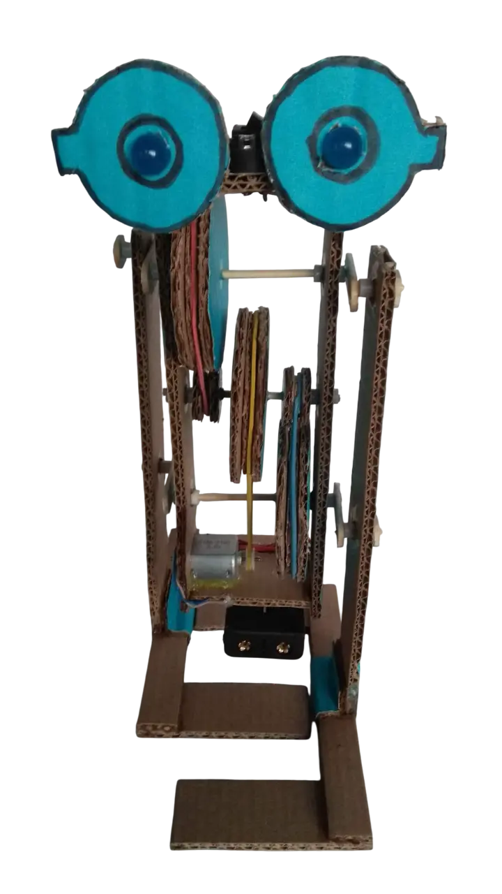
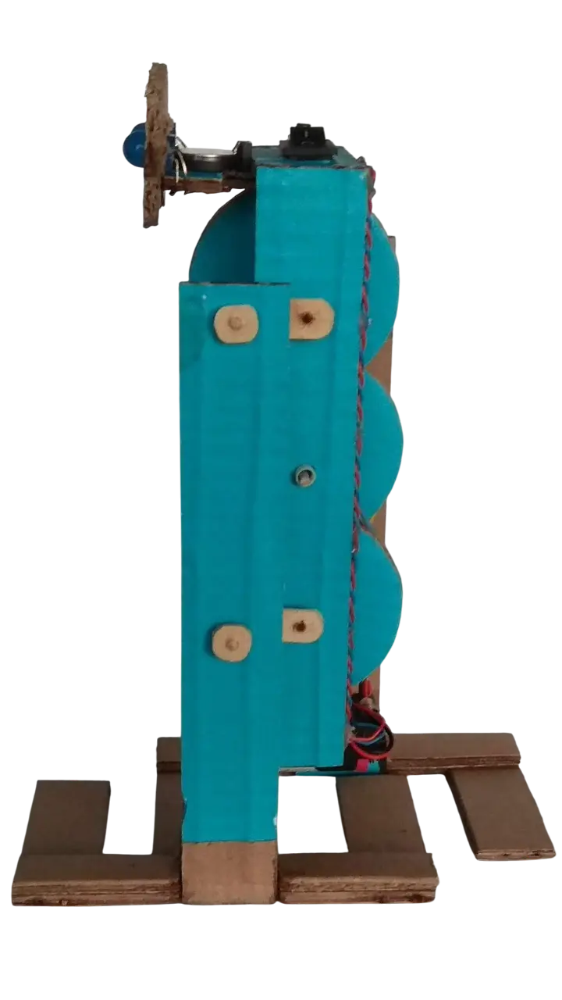
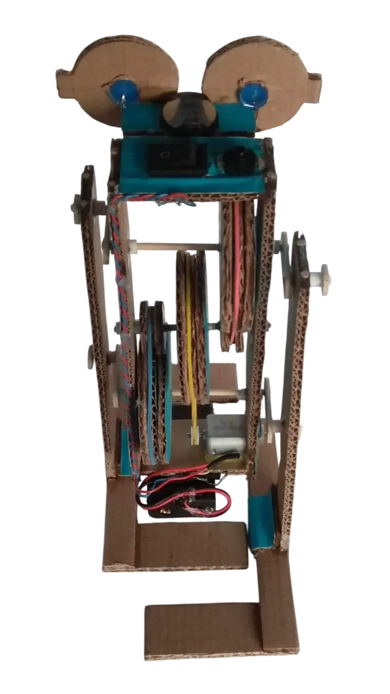

### Описание проекта
Создание конструкции шагающего робота из картона, приводимого в движение электромотором и оснащённого самодельным редуктором с ремённой передачей.

> **Смотри также:** [Принцип работы гофрированного картона](https://www.antech.ru/wiki/stati/gofrokarton/).

### Область применения
Принцип движения этого робота можно применить в настоящих космических роботах-помощниках, которые будут переносить инструменты и запчасти между базами на других планетах. Такие машины смогут автоматически доставлять грузы, переступая через небольшие препятствия на своем пути.

> **Смотри также:** [Шагающие машины ВНИИ Трансмаш, 1980 год](https://youtu.be/hQSO-6LvINQ).

### Развитие проекта
Возможны варианты модификации робота путем добавления в его конструкцию светодиодов для зажигания глаз, функции дистанционного управления и разворота при встрече с препятствием.

### Файлы проекта
1. 📄[Сборочный чертеж, PDF](simple-cardboard-walking-robot.pdf)
2. 📐[Сборочный чертеж, LibreCAD](simple-cardboard-walking-robot.dxf)

### Дневник проекта
<ul>
  
  
    
      <li>
        {{ post.date | date: "%d.%m.%Y" }} — 
        <a href="{{ post.url | relative_url }}">{{ post.title }}</a>
      </li>
    
  
</ul>

### Фотографии работ


[Все фотографии работ →](/photos/?project={{ project_slug }})


[Смотреть все фотографии работ →](/photos/?project={{ project_slug }}&nav={{ page.url | split: '/' | [1] }})

<ul>
  
  
    
      <li>
        {{ post.date | date: "%d.%m.%Y" }} — 
        <a href="{{ post.url | relative_url }}">{{ post.title }}</a>
      </li>
    
  
</ul>

