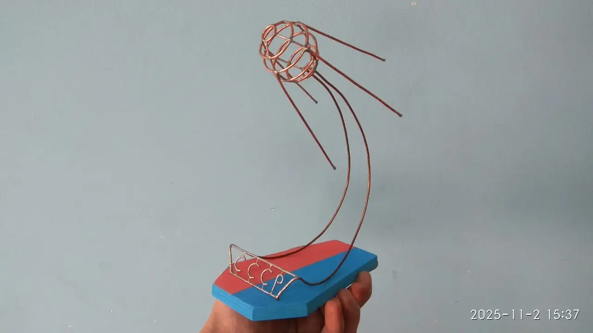

### Описание проекта
**4 октября 1957 года** – запущен на орбиту (во время Международного геофизического года) советский космический аппарат «Спутник-1» первый в мире искусственный спутник Земли, который открыл, как принято считать, новую, космическую эру в жизни человечества. Проект направлен на создание скульптуры модели спутника из меди и дерева.

> **Смотри также:** [Принцип работы гофрированного картона](https://www.antech.ru/wiki/stati/gofrokarton/).

### Область применения

> **Смотри также:** [Шагающие машины ВНИИ Трансмаш, 1980 год](https://youtu.be/hQSO-6LvINQ).

### Развитие проекта
Возможна модификация робота путем установки светодиодов для «зажигания глаз», что позволит роботу передвигаться в ночи и освещать путь в темных зонах других планет. Добавление дистанционного управления  для точной доставки грузов между базами.
