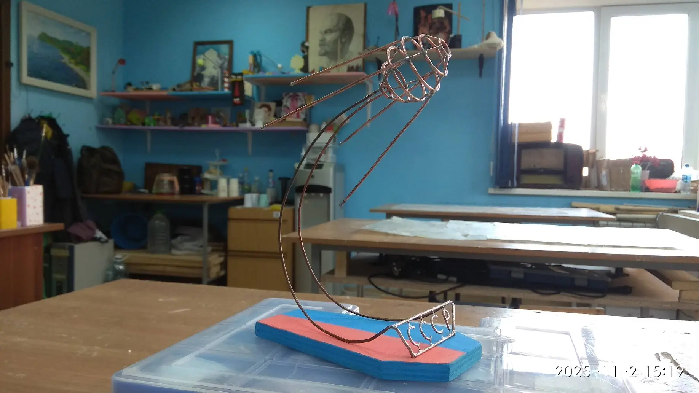
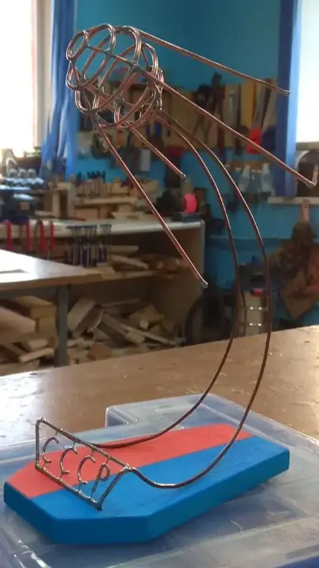
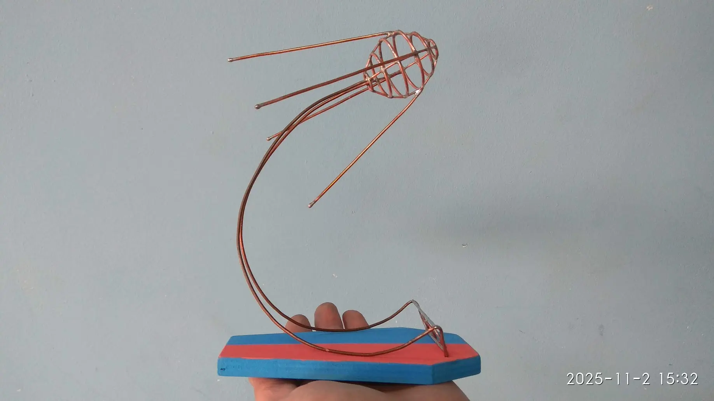
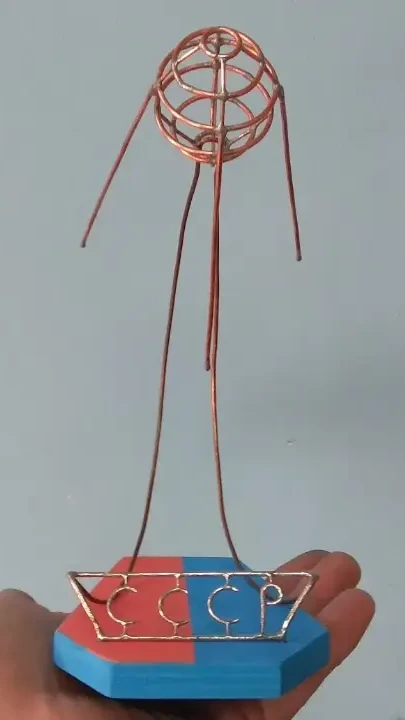

### Описание проекта
**4 октября 1957 года** на орбиту был запущен (во время Международного геофизического года) советский космический аппарат «Спутник-1» – первый в мире искусственный спутник Земли, который открыл, как принято считать, новую космическую эру в истории человечества. Проект направлен на создание скульптуры модели спутника из меди и дерева в произвольном масштабе.

> **Смотри также:** [Sputnik’s Transmitter Beeps Again \| Hackaday](https://hackaday.com/2016/02/23/sputniks-transmitter-beeps-again/).

### Область применения
Украшение интерьера и создание памятной скульптуры великого достижения. Модель служит напоминанием о том, как человечество сделало первый шаг в космос, и вдохновляет юных инженеров на новые открытия и полеты к звездам.

> **Смотри также:** [Model Sputnik Finds Its Voice After Decades Of Silence \| Hackaday](https://hackaday.com/2017/04/25/model-sputnik-finds-its-voice-after-decades-of-silence/)

### Развитие проекта
Монтаж в подставке электронного звукового модуля, который будет воспроизводить знаменитые позывные «Бип-Бип». Добавление светодиодной индикации для имитации работы бортовых систем настоящего космического аппарата.

> **Смотри также:**
> 
> 1\. [The Soviet Sputnik Model Project](https://youtu.be/yNuD6N6IBck), [Updates, More 45's, DSKY Project, Sputnik, Viewer Mail, And Missy! - YouTube](https://youtu.be/hiqibWP2WNA), [FranLab DIY: Sputnik Beeper Kit Pt1](https://youtu.be/7bx2uC89ObY), [FranLab - 1957 Soviet Sputnik Model Reborn](https://youtu.be/b8KduFyLevk) от [Fran Blanche](https://eaststandart.github.io/people/2026/05/13/fran-blanche.html).
> 
> 2\. [Схема электрическая модуля звукового](https://images.squarespace-cdn.com/content/548b5b70e4b0b57ba182907d/1439892567207-H2ZLG0SPJOTJA8E82TOX) от [Fran Blanche](https://eaststandart.github.io/people/2026/05/13/fran-blanche.html).
