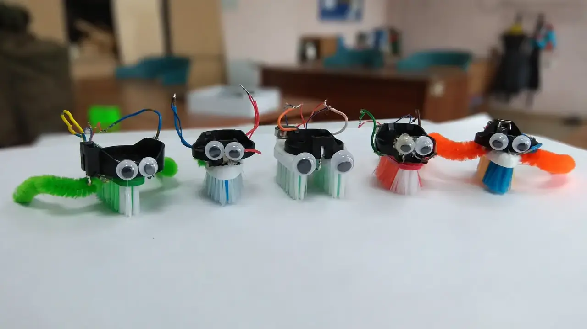
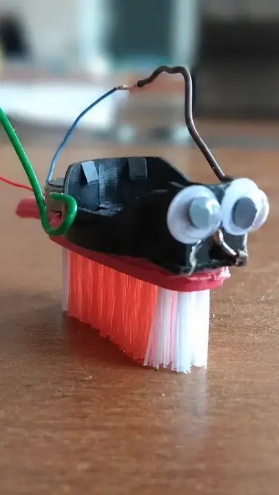
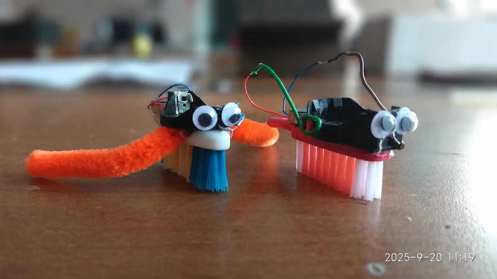
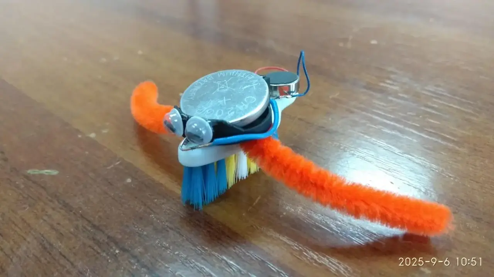

### Описание проекта
Создание конструкции простого виброхода с использованием зубной щетки и миниатюрного вибромотора.

> **Примечание:** Виброход — это устройство для движения по твёрдым поверхностям за счет вибрационного движителя. Когда мотор начинает вибрировать, устройство словно подпрыгивает и медленно ползёт по полу или по столу. Если такой мотор поставить на зубную щётку, то щетинки будут отталкиваться от поверхности, и щётка побежит, как будто у неё появились маленькие ножки. 

### Область применения
Демонстрация принципа работы вибрационного движителя на твердых поверхностях. Моделирование прототипов будущих космических микророботов, способных перемещаться по обшивке орбитальных станций, проникать в труднодоступные узлы кораблей для диагностики, где не справляются обычные колёса.

> **Примечание:** Принцип действия виброхода основан на возникновении продольных сил при вибрации гибких щетинок, расположенных наклонно к опорной поверхности (смотри также: [виброходы](https://r9al.ru/2024/vibrohod/index.htm)).

### Развитие проекта
1\. Создания трассы с препятствиями для тестирования проходимости робота.
2\. Можно провести игры: гонки роботов [Racing Bristlebots: On Your Mark. Get Set. Go!](https://www.sciencebuddies.org/science-fair-projects/project-ideas/Robotics_p010/robotics/racing-bristlebots) или  прохождение лабиринта [Easy DIY Robots for Kids](https://youtu.be/5fPU9LJgTbA).
3\. Выполнить научный проект: изучить движение роботов [Bristlebot Motion Tracking | Science Project](https://youtu.be/NmMflaqzJXQ)

### Журнал проекта
**Назначение:** этапы создания, отладка и усовершенствование.



### Галерея работ
**Назначение:** демонстрация (фото, видео) выполненного проекта от участников.


