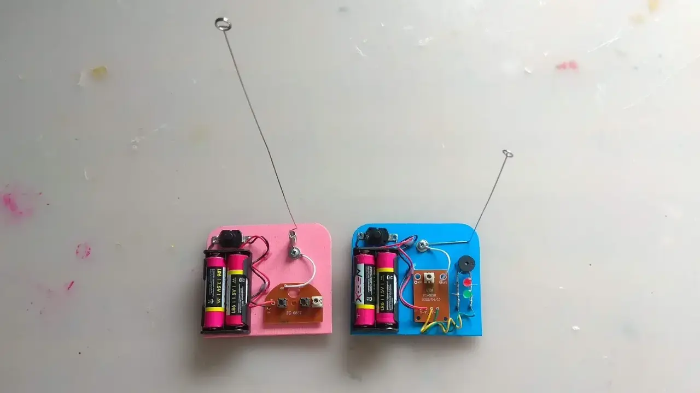
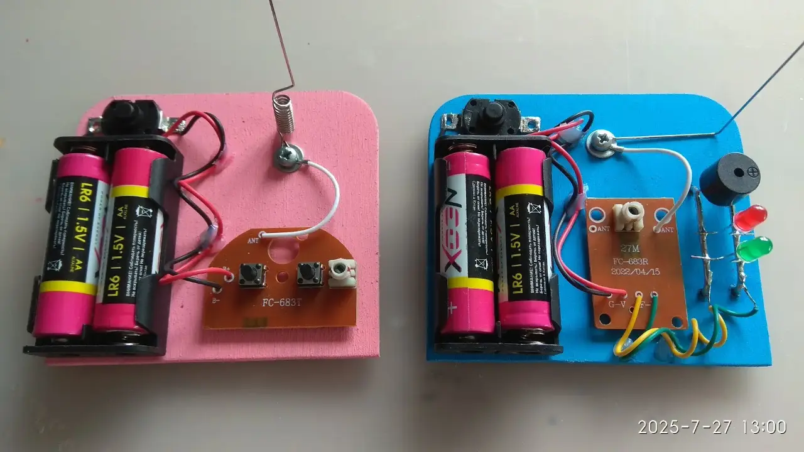

### Описание проекта
Создание конструкции и электрической схемы  беспроводного телеграфа для передачи сообщений азбукой Морзе на частоте 27 МГц.

### Область применения
Исследование дальности радиопередачи и проницаемости волн через препятствия. Моделирование систем связи для передачи сигналов между базами на других планетах, где радиоволны являются единственным надежным способом передачи данных на большие расстояния.

### Развитие проекта
Можно применить как модуль управления или связи для установки на [шагающего робота](/faire/simple-cardboard-walking-robot/). Это позволит превратить его в разведывательный зонд, способный передавать отчеты о маршруте и автоматически отправлять сигнал SOS при поломке или столкновении с непреодолимым препятствием.
