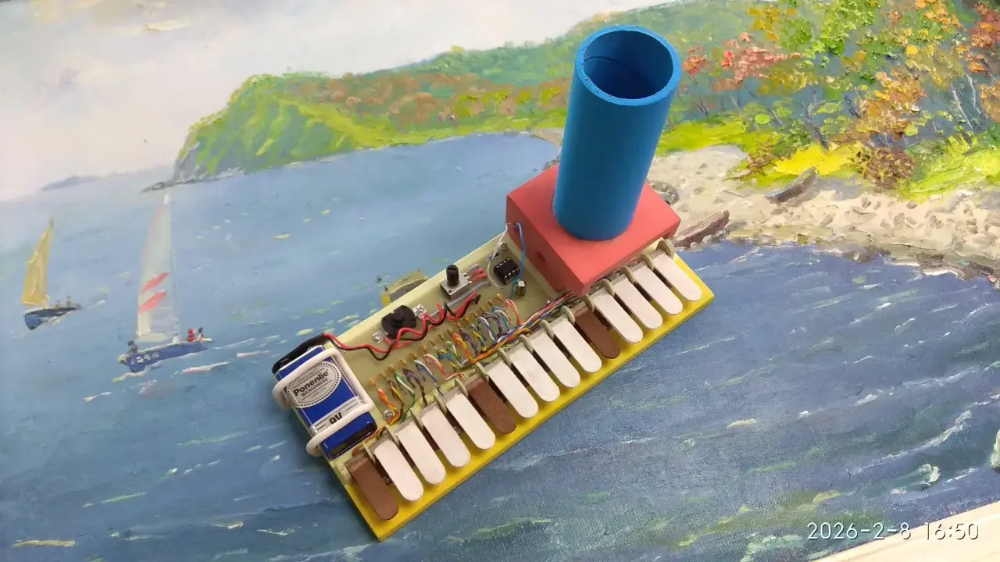
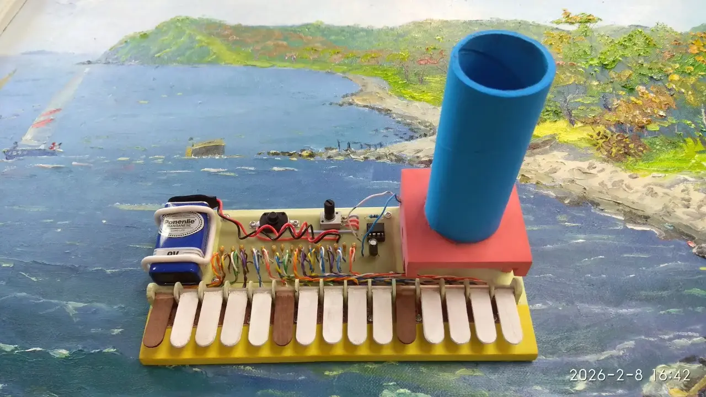
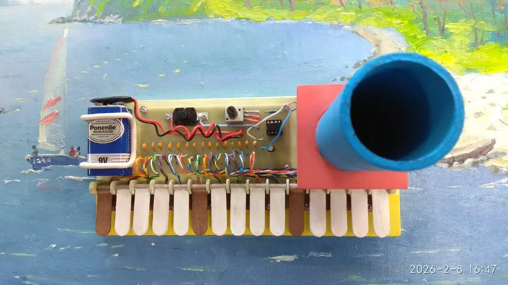

### Описание проекта
Создание конструкции и электрической схемы пятнадцатитонального электронного органа с применением микросхемы таймера 555, предназначенного для воспроизведения несложных мелодий. Устройство собрано на деревянном основании, где закреплены печатная плата с электронной схемой, самодельные клавиши и блок акустического диффузора. Оригинальная форма деревянных деталей в сочетании с открытым монтажом электроники создаёт уникальный футуристический образ.

### Область применения
Использование в качестве уникального музыкального инструмента и наглядного пособия по изучению тонального кодирования звука. Поскольку каждая клавиша устройства генерирует сигнал строго на своей частоте, прибор служит прототипом пульта дистанционного звукового управления автоматикой. Для юного инженера это модель командного пульта космического корабля, способная звуковыми кодами бесконтактно активировать бортовые приборы, открывать шлюзы станций или передавать команды роботам-планетоходам.

### Развитие проекта
1\. Модификация конструкции устройства до варианта пульта дистанционного тонального управления движением модели (планетохода или робота) на основе решений, описанных в литературе: [Мацкевич, 1986, с. 91], [Отряшенков, 1967, с. 229], [Борисов, 2001, с. 425].\
2\. Создание на базе устройства музыкального синтезатора со встроенными самодельными звуковыми эффектами.

### Файлы проекта
1\. 📄[Схема электрическая принципиальная, PDF](blaster-elektroakusticheskij-esd.pdf)\
2\. 🔌[Схема электрическая принципиальная, sPlan](blaster-elektroakusticheskij-esd.spl8)

### Журнал проекта
<!-- *Назначение: этапы создания, отладка и усовершенствование.* -->


### Галерея работ
<!-- *Назначение: демонстрация (фото, видео) выполненного проекта от участников.* -->


### Литература
1\. Мацкевич В.В. Занимательная радиоэлектроника в пионерлагере. 1986.\
2\. Отряшенков Ю.М. Азбука телеавтоматики. 1967.\
3\. Борисов В.Г. Энциклопедия юного радиолюбителя-конструктора. 2001.
