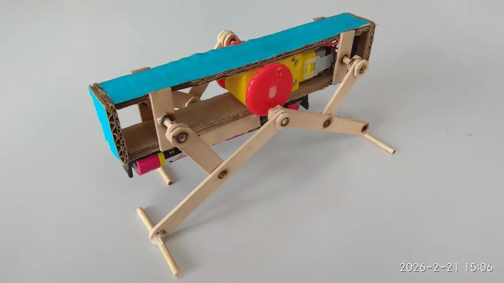
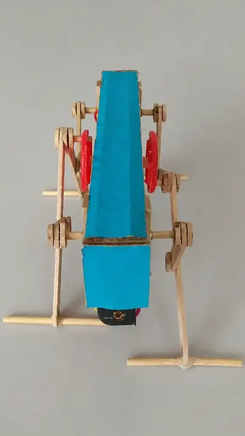

Создание конструкции простого прямоходящего робота на четырех ногах из картона, приводимого в движение с помощью электромотора и редуктора. 

### Описание проекта
Создание конструкции и электрической схемы пятнадцатитонального электронного органа с применением микросхемы таймера 555, предназначенного для воспроизведения несложных мелодий. Устройство собрано на деревянном основании, где закреплены печатная плата с электронной схемой, самодельные клавиши и блок акустического диффузора. Оригинальная форма деревянных деталей в сочетании с открытым монтажом электроники создаёт уникальный футуристический образ.

### Область применения
Использование в качестве оригинального музыкального инструмента и наглядного пособия по изучению тонального кодирования звука. Поскольку каждая клавиша устройства генерирует сигнал строго на своей частоте, прибор служит прототипом пульта дистанционного звукового управления автоматикой. Для юного инженера это модель командного пульта космического корабля, способная звуковыми кодами бесконтактно включать бортовые приборы, открывать шлюзы станций или передавать команды роботам-планетоходам.

### Развитие проекта
1\. Модификация конструкции возможна путем добавления функции дистанционного управления.

### Файлы проекта
1\. 📄[Схема электрическая принципиальная, PDF](blaster-elektroakusticheskij-esd.pdf)\
2\. 🔌[Схема электрическая принципиальная, sPlan](blaster-elektroakusticheskij-esd.spl8)

### Журнал проекта
<!-- *Назначение: этапы создания, отладка и усовершенствование.* -->


### Галерея работ
<!-- *Назначение: демонстрация (фото, видео) выполненного проекта от участников.* -->


