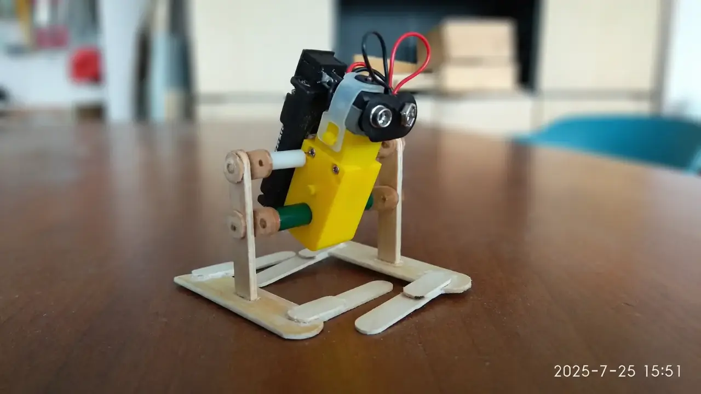
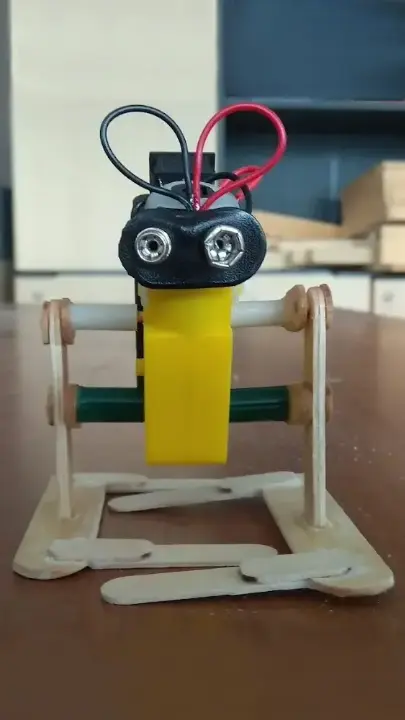
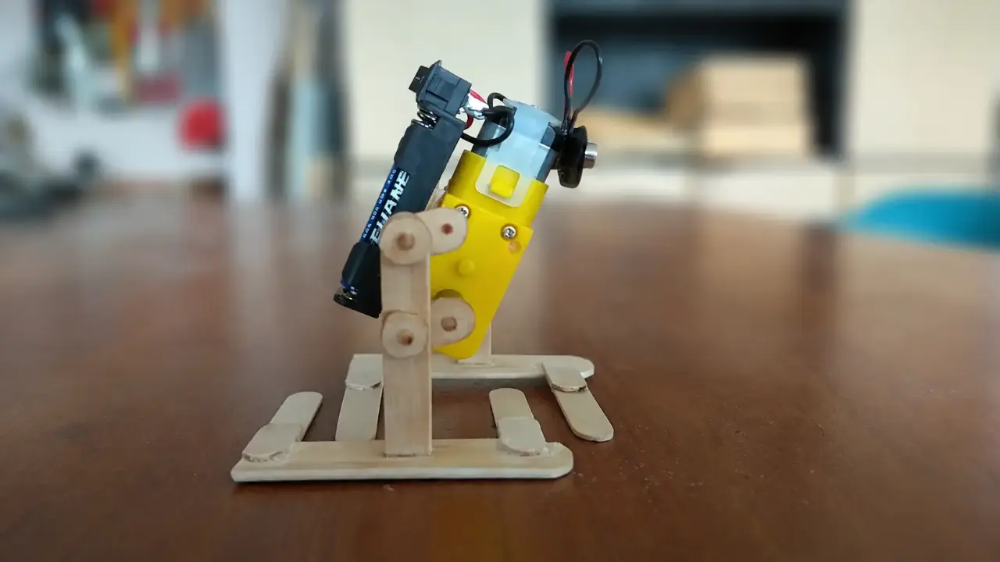
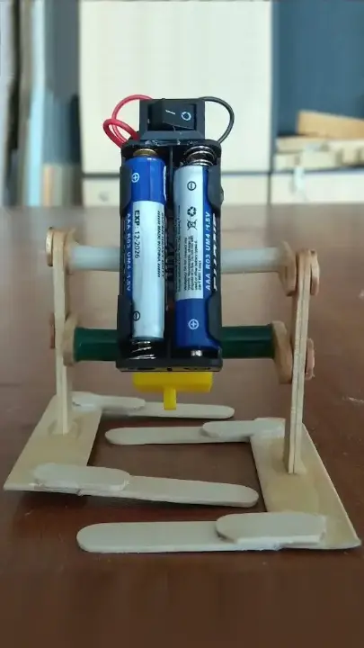

### Описание проекта
Создание конструкции простого двуногого шагающего робота, приводимого в движение унифицированным мотор-редуктором.

### Область применения
Демонстрация принципов двухшарнирной ходовой механики. Моделирование систем перемещения для исследовательских аппаратов («странников»), способных передвигаться по сложному каменистому рельефу других планет, где колесные вездеходы могут застрять в грунте.

### Развитие проекта
1\. Замена элементов питания на аккумулятор для повышения длительности автономного путешествия.\
2\. Организация соревнований по гонкам шагающих роботов на скорость и прохождение сложной рельефной трассы для проверки проходимости и удержания баланса.

### Галерея работ
**Назначение:** демонстрация (фото, видео) выполненного проекта от участников.


