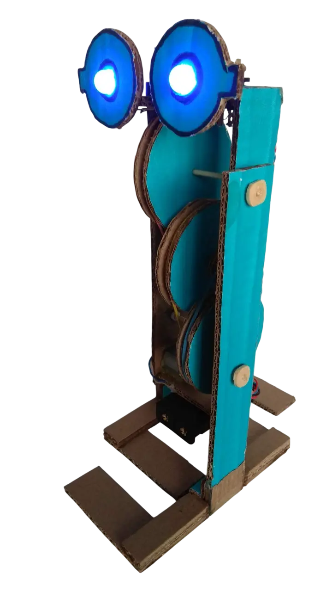

### Описание проекта
Создание конструкции шагающего робота из картона, приводимого в движение электромотором и оснащённого самодельным редуктором с ремённой передачей.

> **Смотри также:** [Принцип работы гофрированного картона](https://www.antech.ru/wiki/stati/gofrokarton/).

### Область применения
Принцип движения этого робота можно применить в настоящих космических роботах-помощниках, которые будут переносить инструменты и запчасти между базами на других планетах. Такие машины смогут автоматически доставлять грузы, переступая через небольшие препятствия на своем пути.

> **Смотри также:** [Шагающие машины ВНИИ Трансмаш, 1980 год](https://youtu.be/hQSO-6LvINQ).

### Развитие проекта
Возможна модификация робота путем установки светодиодов для «зажигания глаз», что позволит роботу передвигаться в ночи и освещать путь в темных зонах других планет. Добавление дистанционного управления  для точной доставки грузов между базами.

### Файлы проекта
1. 📄[Сборочный чертеж, PDF](simple-cardboard-walking-robot.pdf)
2. 📐[Сборочный чертеж, LibreCAD](simple-cardboard-walking-robot.dxf)

### Журнал проекта
**Назначение:** этапы создания, отладка и усовершенствование.

<ul class="project-list" style="list-style: none; padding: 0; margin: 0;">
  <li style="margin-bottom: 12px;">
    <a href="{{ '/journal/' | relative_url }}?project=simple-cardboard-walking-robot" style="font-weight: bold; color: var(--card-tech);">
      <strong>Весь журнал проекта →</strong>
    </a>
  </li>

  <!-- Вызываем наше оригинальное ядро, требуем только категорию journal -->
  
</ul>

### Галерея работ
**Назначение:** демонстрация (фото, видео) выполненного проекта от участников.

<ul class="project-list" style="list-style: none; padding: 0; margin: 0;">
  <li style="margin-bottom: 12px;">
    <a href="#смотреть-все-галерея" style="font-weight: bold; color: var(--card-my);">
      <strong>Смотреть всю галерею →</strong>
    </a>
  </li>

  <!-- Вызываем наше оригинальное ядро, требуем только категорию media -->
  
</ul>
