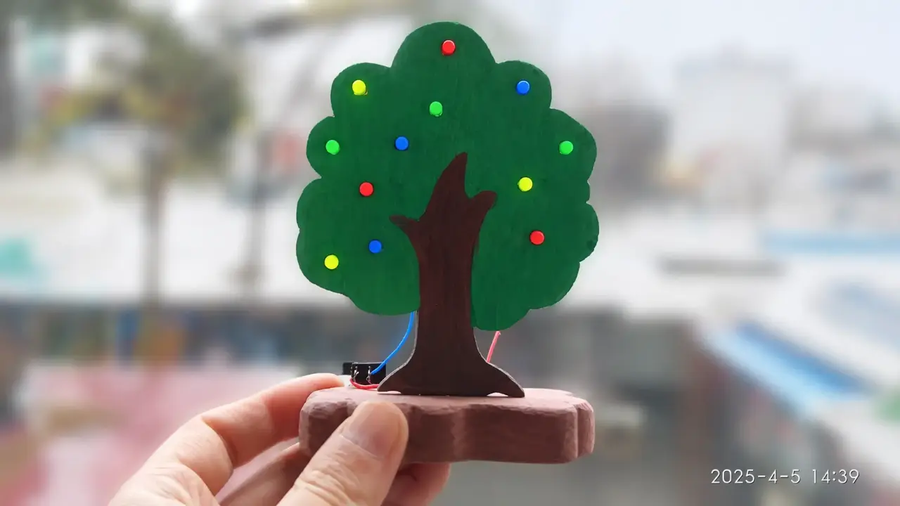
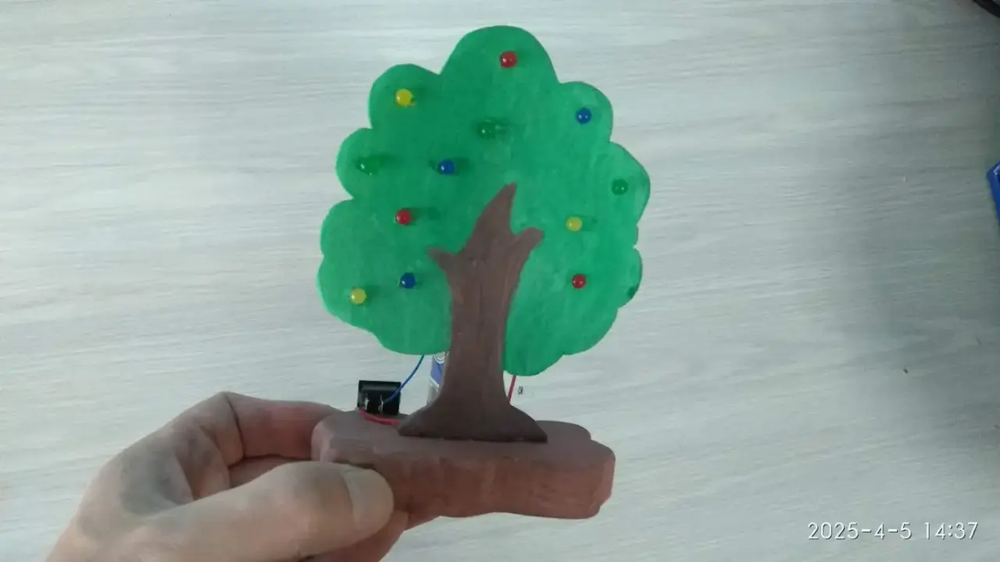
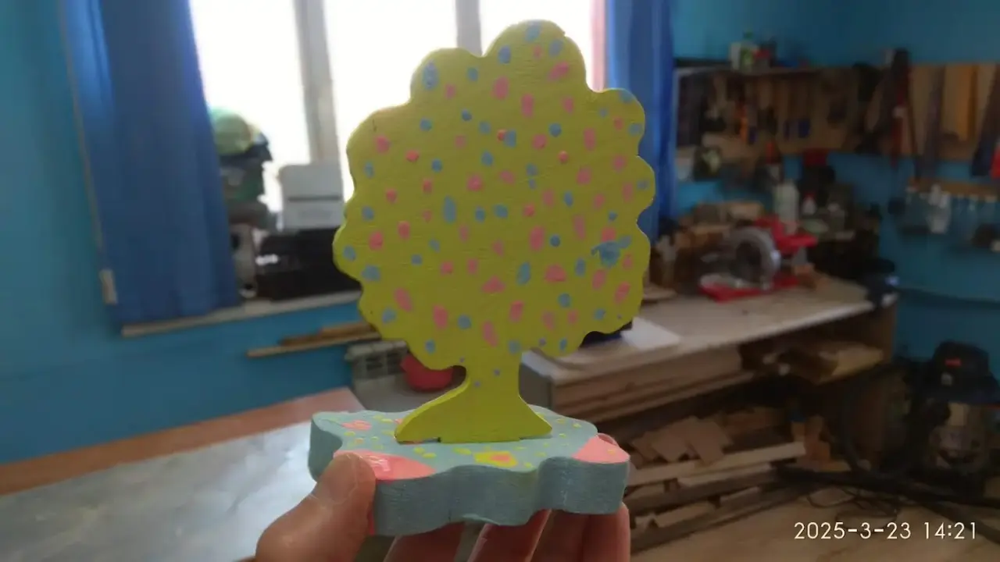
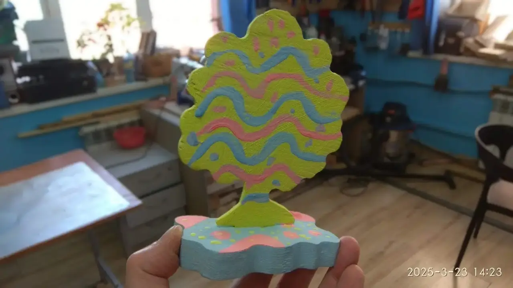

### Описание проекта
Создание конструкции яблоневого дерева из фанеры на подставке из цельной древесины и электрической схемы с параллельно-последовательным включением [светодиодов](https://t.me/RadiotekhnikaClub/618/711) и токоограничивающими [резисторами](https://t.me/RadiotekhnikaClub/618/736). 

### Область применения
Украшение интерьера, создание оригинального ночника и демонстрация работы параллельно-последовательных электрических цепей. Модель служит макетом космического сада. В темноте светящиеся яблоки напоминают сигнальные огни на приборной панели корабля, который везет земные растения к новой планете.

### Развитие проекта
1\. Добавление в схему детектора освещенности для автоматического включения устройства в ночное время.\
2\. Подключение модуля управления для создания динамических эффектов: имитации созревания плодов через плавное изменение яркости светодиодов.\
3\.  Изменение конструкции поделки: в виде радуги на подставке, где цветовые полосы будут подсвечиваться своим цветом светодиодов. Радугу сделать в виде, взлетающей по окружности, звезды.

### Файлы проекта
1. 📄[Яблоневое дерево. Трафарет, PDF](yablonevoe-derevo-trafaret.pdf)
2. 📄[Яблоневое дерево. Трафарет, sPlan](yablonevoe-derevo-trafaret.spl8)
3. 🔌Принципиальная электрическая схема устройства такая же как и в проекте «[Новогодняя ёлочка](https://t.me/RadiotekhnikaClub/2/931)». 
4. 📐Сборочный чертеж устройства такой же как и в проекте «[Новогодняя ёлочка](https://t.me/RadiotekhnikaClub/2/931)». 
