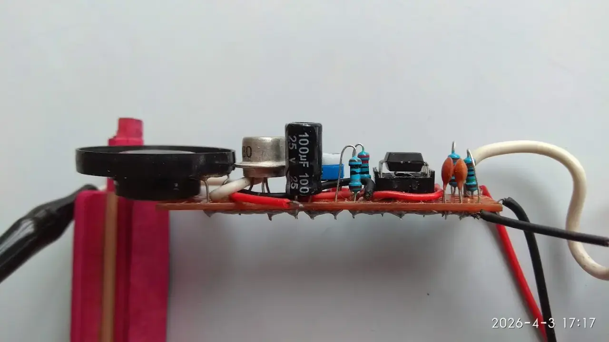
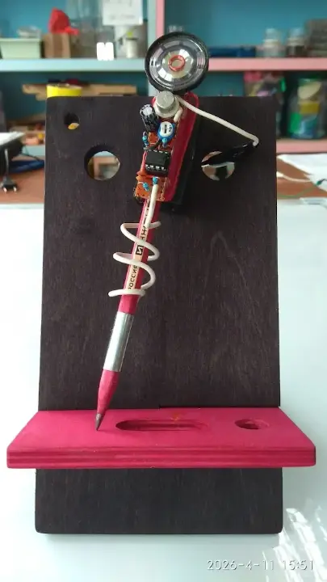

#### Одиночные картинки

1-1 `!\ и ![[путь]] `

![[../faire/muzykalnyj-karandash/muzykalnyj-karandash-19.webp]]

1-2 ` и ![[путь|{v}]]`

![[../faire/muzykalnyj-karandash/muzykalnyj-karandash-02.webp|{v}]]

1-3  ` и ![[путь|{alt text}]]`

![[../faire/muzykalnyj-karandash/muzykalnyj-karandash-19.webp|{alt text}]]

1-4  ` и ![[путь|{v|alt text}]]`

![[../faire/muzykalnyj-karandash/muzykalnyj-karandash-02.webp|{v|alt text}]]

1-5 ` и ![[путь|{320x405}]]`

![[../faire/muzykalnyj-karandash/muzykalnyj-karandash-02.webp|{320x405}]]

1-6  ` и ![[путь|{320x405|alt text}]]`

![[../faire/muzykalnyj-karandash/muzykalnyj-karandash-02.webp|{320x405|alt text}]]

1-7  ` и ![[путь|{alt text}|400]]`

![[../faire/muzykalnyj-karandash/muzykalnyj-karandash-02.webp|{alt text|400}]]

#### Групповые картинки

2-1 `!\ и ![[путь]] `

![[../faire/muzykalnyj-karandash/muzykalnyj-karandash-19.webp]]

2-2 ` и ![[путь|{v}]]`

![[../faire/muzykalnyj-karandash/muzykalnyj-karandash-02.webp|{v}]]

2-3  ` и ![[путь|{alt text}]]`

![[../faire/muzykalnyj-karandash/muzykalnyj-karandash-19.webp|{alt text}]]

2-4  ` и ![[путь|{v|alt text}]]`

![[../faire/muzykalnyj-karandash/muzykalnyj-karandash-02.webp|{v|alt text}]]

2-5 ` и ![[путь|{320x405}]]`

![[../faire/muzykalnyj-karandash/muzykalnyj-karandash-02.webp|{320x405}]]

2-6  ` и ![[путь|{320x405|alt text}]]`

![[../faire/muzykalnyj-karandash/muzykalnyj-karandash-02.webp|{320x405|alt text}]]

2-7  ` и ![[путь|{alt text}|400]]`

![[../faire/muzykalnyj-karandash/muzykalnyj-karandash-02.webp|{alt text|400}]]

#### Сокращенный вариант записи ссылки

3-7 `  `

1 ``

2 ``

3 ``

4 ``

#### Ссылки в тексте

Посмотрим, из чего она состоит: *R1* – резистор с сопротивлением 1–6,8 кОм, *R2* – резистор с сопротивлением 2,7–3,6 кОм, *С1* – конденсатор емкостью 10 мкФ х 10 В, рассчитанный на рабочее напряжение не ниже 6–10 В, *VT1* – любой маломощный транзистор структуры *p-n-p* (МП39–МП42). *G1* – батарея питания напряжением 9 В типа «Крона». *SA1* – выключатель любой конструкции. *Т1* – любой выходной трансформатор транзисторного радиоприемника (ТВКП – трансформатор выходной карманного приемника), от радиоточки (абонентского громкоговорителя) или [[самодельный трансформатор|самодельный]]. *BA1* – любой динамик до 0,5 Вт сопротивлением 8 Ом, возможно от радиоточки.
